# Architecture

Vaaani is split into two connected planes: an **online answer plane** that handles live voice and text requests, and an **offline knowledge plane** that prepares multilingual evidence for retrieval. FastAPI exposes the service boundary, LangGraph owns control flow and failure routing, Qdrant is the shared evidence store, and every terminal response carries the evidence and telemetry needed to explain what happened.

## End-to-end system blueprint

The diagram below is the complete request, retrieval, safety, ingestion, observability, and delivery path. Solid arrows carry request or data flow; dashed arrows carry telemetry, configuration, or operational feedback.

```mermaid
%%{init: {"theme":"base","themeVariables":{"fontFamily":"Inter, ui-sans-serif, system-ui","primaryTextColor":"#172033","lineColor":"#64748b","clusterBkg":"#f8fafc","clusterBorder":"#cbd5e1"},"flowchart":{"curve":"basis","nodeSpacing":28,"rankSpacing":52,"htmlLabels":true}}}%%
flowchart TB
    subgraph EXPERIENCE["01 · MULTILINGUAL EXPERIENCE LAYER"]
        direction LR
        PERSON((User))
        MIC["Browser microphone<br/><b>MediaRecorder</b>"]
        TEXT["Typed question<br/><b>Text input</b>"]
        LANG["Language selector<br/>en · hi · bn · ta · mr · te"]
        HISTORY[("Recent conversation<br/>last 12 turns")]
        REC["VoiceRecorder<br/>live state · 30 s limit"]
        CLIENT["Typed API client<br/>SSE parser · Base64 audio"]
        UI["Answer workspace<br/>stream · citations · audio"]

        PERSON -->|speaks| MIC --> REC -->|audio/webm| CLIENT
        PERSON -->|types| TEXT --> CLIENT
        LANG -->|BCP-47 code| CLIENT
        HISTORY -->|context| CLIENT
    end

    subgraph EDGE["02 · API AND SERVICE BOUNDARY"]
        direction LR
        STREAM["POST /query/stream<br/><b>Server-Sent Events</b>"]
        QUERY["POST /query<br/><b>JSON response</b>"]
        HEALTH["GET /health<br/>index + provider status"]
        VALIDATE{"Pydantic request<br/>validation"}
        CONTAINER["ServiceContainer<br/>provider composition"]
        INIT["FastAPI lifespan<br/>collection initialization"]

        STREAM --> VALIDATE
        QUERY --> VALIDATE
        HEALTH --> CONTAINER
        INIT --> CONTAINER
    end

    CLIENT -->|query · audio · language · history| STREAM
    CLIENT -. non-streaming clients .-> QUERY
    VALIDATE -->|typed QueryRequest| CONTAINER

    subgraph ONLINE["03 · LANGGRAPH ONLINE ANSWER PLANE"]
        direction TB

        START((START)) --> REQUEST["Create GraphState<br/>request_id · inputs · empty trace"]
        REQUEST --> STT{"stt_node<br/>text already present?"}
        STT -->|yes| TRANSCRIPT["Use typed query<br/>as transcript"]
        STT -->|audio| SARVAM_STT["Sarvam Saaras v3<br/>speech-to-text"]
        SARVAM_STT --> TRANSCRIPT
        SARVAM_STT -->|3 failed attempts| REFUSE

        TRANSCRIPT --> TOPIC{"query_classify_node<br/>safe + searchable?"}
        TOPIC -->|unsafe / empty| REFUSE
        TOPIC -->|allowed| REWRITE["query_rewrite_node<br/>resolve conversational references"]

        REWRITE --> FANOUT{"retrieve_node<br/>parallel fan-out"}

        subgraph HYBRID["HYBRID RETRIEVAL · CANDIDATE GENERATION"]
            direction LR

            QEMBED["Encode rewritten query<br/><b>multilingual MPNet · 768d</b>"]
            FILTER["Language filter<br/>BCP-47 → dataset code"]
            DENSE["Qdrant cosine search<br/>dense top 50"]
            SCROLL["Qdrant payload scan<br/>language corpus"]
            TOKENIZE["Unicode tokenization"]
            BM25["BM25 sparse ranking<br/>sparse top 50"]
            RRF["Reciprocal Rank Fusion<br/><b>normalized top 20</b>"]

            QEMBED --> DENSE
            FILTER --> DENSE
            FILTER --> SCROLL --> TOKENIZE --> BM25
            DENSE --> RRF
            BM25 --> RRF
        end

        FANOUT --> QEMBED
        FANOUT --> FILTER
        RRF --> RERANK["rerank_node<br/><b>MS MARCO cross-encoder</b>"]
        RERANK --> TOP5["Evidence set<br/><b>top 5 passages</b>"]
        TOP5 --> CONF{"confidence_gate_node<br/>score ≥ threshold?"}
        CONF -->|no results / low score| REFUSE
        CONF -->|passed| GENERATE["generate_node<br/>evidence-only prompt + citations"]

        GENERATE --> LLM{"Generation provider<br/>available?"}
        LLM -->|yes| REMOTE_LLM["OpenAI-compatible LLM<br/>OpenAI or OpenRouter"]
        LLM -->|explicit offline mode| EXTRACTIVE["Extractive grounded answer<br/>citation-preserving fallback"]
        REMOTE_LLM --> DRAFT["Draft answer<br/>inline source markers"]
        EXTRACTIVE --> DRAFT

        DRAFT --> NLI{"groundedness_check_node<br/>NLI entailment passed?"}
        TOP5 -->|premise evidence| NLI
        NLI -->|unsupported| REFUSE
        NLI -->|checker unavailable| FAILCLOSED["Fail closed<br/>groundedness_check_unavailable"] --> REFUSE
        NLI -->|entailed| TTS["tts_node<br/>Sarvam Bulbul v3"]
        TTS -->|audio base64 + MIME| RESPONSE
        TTS -->|3 failed attempts| TEXTONLY["Keep trusted text<br/>mark sarvam_tts degraded"] --> RESPONSE

        REFUSE["refuse_node<br/><b>specific machine-readable reason</b>"]
        REFUSE --> RESPONSE["response_node<br/>deduplicate degradation state"]
        RESPONSE --> END((END))
    end

    CONTAINER --> START

    subgraph EVIDENCE["04 · QDRANT EVIDENCE STORE"]
        direction TB
        COLLECTION[("vaaani_passages<br/>cosine vector collection")]
        VECTOR["Dense vector<br/>768 dimensions"]
        PAYLOAD["Filterable payload<br/>language · passage_id · strategy"]
        PROVENANCE["Translation provenance<br/>source_lang · target_lang"]
        LABELS["Evaluation metadata<br/>query_id · query_type · is_selected"]

        COLLECTION --- VECTOR
        COLLECTION --- PAYLOAD
        PAYLOAD --- PROVENANCE
        PAYLOAD --- LABELS
    end

    DENSE <--> COLLECTION
    SCROLL <--> COLLECTION

    subgraph KNOWLEDGE["05 · OFFLINE MULTILINGUAL KNOWLEDGE PLANE"]
        direction TB
        DATASET[("AI4Bharat / MSMARCO-XI<br/>parallel query-passage records")]
        SUBSETS["Balanced language subsets<br/>English · Hindi · Bengali · Tamil · …"]
        NORMALIZE["Record normalization<br/>passage IDs + provenance"]
        STRATEGY{"Configured chunk strategy"}

        subgraph CHUNKERS["SELECTABLE CHUNKING PIPELINE"]
            direction LR
            FIXED["Fixed-size<br/>256 units · 20% overlap"]
            SEMANTIC["Semantic<br/>sentence cosine breakpoints"]
            META["Metadata-aware<br/>native passage boundary"]
        end

        CHUNKS["Typed Chunk records<br/>stable UUIDs + payload"]
        DOCEMBED["Batch encoding<br/><b>multilingual MPNet</b>"]
        UPSERT["IndexBuilder<br/>batch upsert + recreate"]

        DATASET --> SUBSETS --> NORMALIZE --> STRATEGY
        STRATEGY --> FIXED
        STRATEGY --> SEMANTIC
        STRATEGY --> META
        FIXED --> CHUNKS
        SEMANTIC --> CHUNKS
        META --> CHUNKS
        CHUNKS --> DOCEMBED --> UPSERT
    end

    UPSERT -->|vectors + payload| COLLECTION

    subgraph TRUST["06 · OBSERVABILITY, TRUST, AND OPERATIONS"]
        direction LR
        TIMING[("Per-stage trace<br/>start · end · duration · status")]
        GUARD[("Guardrail audit<br/>decision · reason · score")]
        DEGRADE[("Degraded services<br/>provider + fallback visibility")]
        BENCH["Live benchmark runner<br/>50 multilingual queries"]
        PERCENTILES["P50 · P70 · P100<br/>per stage + total"]
        REPORTS[("Timestamped JSON<br/>and Markdown reports")]
        DOCS["MkDocs architecture<br/>benchmarks + decisions"]
        OPS["Health surface<br/>chunk count · retrieval mode"]

        BENCH -->|HTTP requests| STREAM
        BENCH --> PERCENTILES --> REPORTS --> DOCS
        HEALTH --> OPS
    end

    ONLINE -. every node .-> TIMING
    TOPIC -. decision .-> GUARD
    CONF -. score + threshold .-> GUARD
    NLI -. entailment .-> GUARD
    SARVAM_STT -. provider failure .-> DEGRADE
    LLM -. provider mode .-> DEGRADE
    TTS -. provider failure .-> DEGRADE

    END -->|QueryResponse metadata| STREAM
    STREAM -->|metadata event| UI
    STREAM -->|validated token events| UI
    STREAM -->|audio event| UI
    TIMING -->|latency dashboard| UI
    GUARD -->|visible refusal banner| UI
    COLLECTION -. indexed chunk count .-> HEALTH

    subgraph DELIVERY["07 · DEPLOYMENT TOPOLOGY"]
        direction LR
        VERCEL["Vercel<br/>Next.js frontend"]
        RAILWAY["Railway<br/>FastAPI + LangGraph"]
        QLOCAL["Development<br/>Docker Qdrant"]
        QCLOUD["Production<br/>Qdrant Cloud · same region"]
        PROVIDERS["External providers<br/>Sarvam · LLM · Hugging Face"]

        VERCEL -->|HTTPS / SSE| RAILWAY
        RAILWAY --> QLOCAL
        RAILWAY --> QCLOUD
        RAILWAY --> PROVIDERS
    end

    classDef person fill:#172033,color:#fff,stroke:#172033,stroke-width:2px;
    classDef experience fill:#e0f2fe,color:#0c4a6e,stroke:#38bdf8,stroke-width:1.5px;
    classDef api fill:#dbeafe,color:#1e3a8a,stroke:#60a5fa,stroke-width:1.5px;
    classDef pipelineNode fill:#eef2ff,color:#312e81,stroke:#818cf8,stroke-width:1.5px;
    classDef retrieval fill:#f3e8ff,color:#581c87,stroke:#c084fc,stroke-width:1.5px;
    classDef provider fill:#fef3c7,color:#78350f,stroke:#f59e0b,stroke-width:1.5px;
    classDef data fill:#ecfdf5,color:#064e3b,stroke:#34d399,stroke-width:1.5px;
    classDef trust fill:#f0fdfa,color:#134e4a,stroke:#2dd4bf,stroke-width:1.5px;
    classDef danger fill:#fee2e2,color:#7f1d1d,stroke:#f87171,stroke-width:2px;
    classDef success fill:#dcfce7,color:#14532d,stroke:#4ade80,stroke-width:2px;
    classDef ops fill:#fff7ed,color:#7c2d12,stroke:#fb923c,stroke-width:1.5px;

    class PERSON person;
    class MIC,TEXT,LANG,HISTORY,REC,CLIENT,UI experience;
    class STREAM,QUERY,HEALTH,VALIDATE,CONTAINER,INIT api;
    class START,REQUEST,STT,TRANSCRIPT,TOPIC,REWRITE,FANOUT,RERANK,TOP5,CONF,GENERATE,DRAFT,NLI,TTS,RESPONSE,END pipelineNode;
    class QEMBED,FILTER,DENSE,SCROLL,TOKENIZE,BM25,RRF retrieval;
    class SARVAM_STT,LLM,REMOTE_LLM,PROVIDERS provider;
    class EXTRACTIVE,TEXTONLY,FAILCLOSED,REFUSE danger;
    class COLLECTION,VECTOR,PAYLOAD,PROVENANCE,LABELS,DATASET,SUBSETS,NORMALIZE,STRATEGY,FIXED,SEMANTIC,META,CHUNKS,DOCEMBED,UPSERT data;
    class TIMING,GUARD,DEGRADE trust;
    class BENCH,PERCENTILES,REPORTS,DOCS,OPS,VERCEL,RAILWAY,QLOCAL,QCLOUD ops;
    class UI,END success;
```

## How to read the architecture

### Online request plane

The browser sends one typed request containing the selected language, recent conversation turns, and either text or Base64-encoded microphone audio. `/query` returns a regular JSON response; `/query/stream` exposes the same final result as SSE metadata, validated answer tokens, optional audio, and a terminal request ID.

`ServiceContainer` builds the provider graph once during application startup. Each LangGraph node receives typed `GraphState`, produces a state update, records its own timing, and gets up to three total attempts. Conditional edges make every refusal path explicit instead of relying on exception-driven routing.

### Hybrid evidence path

The rewritten query fans out into two retrieval paths:

1. **Dense:** multilingual MPNet produces a normalized 768-dimensional query vector and Qdrant performs cosine search under a language filter.
2. **Sparse:** the language-filtered corpus is tokenized and scored with BM25.
3. **Fusion:** reciprocal-rank fusion combines both rankings into 20 candidates.
4. **Reranking:** an MS MARCO cross-encoder narrows the evidence to five passages used by confidence, generation, groundedness, and citations.

The vector collection and its payload are a single source of truth: the online retrievers read the same passage IDs, language fields, chunk strategy, translation provenance, and evaluation labels written by ingestion.

### Trust and refusal path

Three independent gates protect the answer:

- The topic classifier refuses unsafe or non-searchable input before retrieval.
- The confidence gate exposes both the computed score and configured threshold.
- The groundedness gate compares the draft with the top-five evidence passages.

The groundedness checker is deliberately **fail-closed**. If the checker itself fails after all retries, the graph routes to `refuse_node` with `groundedness_check_unavailable`; it never forwards an unchecked answer to speech synthesis. Missing TTS can degrade to trusted text, but missing evidence cannot degrade to an ungrounded answer.

### Offline knowledge plane

MSMARCO-XI records are balanced by configured language, normalized into typed documents, and passed through one of three selectable chunkers. Stable chunk UUIDs make rebuilds deterministic. `IndexBuilder` batches multilingual MPNet embeddings and payloads into Qdrant, where the same collection serves both development and production retrieval.

### Response contract

Every completed request can return:

| Channel | Contents |
|---|---|
| Answer | Grounded text with inline citation markers |
| Voice | Optional Sarvam-generated WAV audio |
| Evidence | Top-five passages, ranks, scores, language and provenance |
| Safety | Guardrail name, result, reason and quantitative details |
| Performance | Per-stage timestamps, duration, status and total latency |
| Operations | Request ID and explicit degraded-service names |

This shared response contract drives `AnswerCard`, `SourceCitation`, `GuardrailBanner`, `LatencyDashboard`, and the status surface without hiding fallback or refusal behavior.

## Runtime and deployment boundaries

The browser communicates only with FastAPI. The backend and Qdrant should run in the same region so retrieval does not inherit external network latency. Sarvam and the configured OpenAI-compatible LLM remain explicit external calls, so STT, generation, groundedness, and TTS are measured separately from retrieval.

For local development, Docker provides persistent Qdrant while `make dev` can use an isolated in-memory collection for lightweight testing. Production replaces local Qdrant with Qdrant Cloud without changing the retrieval or ingestion interfaces.

## Failure semantics

| Failure | Retry behavior | Terminal behavior |
|---|---|---|
| Sarvam STT unavailable | Three total attempts | Refuse with a specific STT reason |
| Qdrant retrieval unavailable | Three total attempts | Empty evidence reaches the confidence refusal path |
| Retrieval confidence low | No provider retry required | Refuse with score and threshold |
| LLM unavailable | Provider policy applies | Explicit offline mode may use extractive generation |
| Groundedness checker unavailable | Three total attempts | Fail closed with `groundedness_check_unavailable` |
| Answer unsupported by evidence | Deterministic decision | Refuse with `groundedness_entailment_failed` |
| Sarvam TTS unavailable | Three total attempts | Preserve trusted text and mark TTS degraded |
