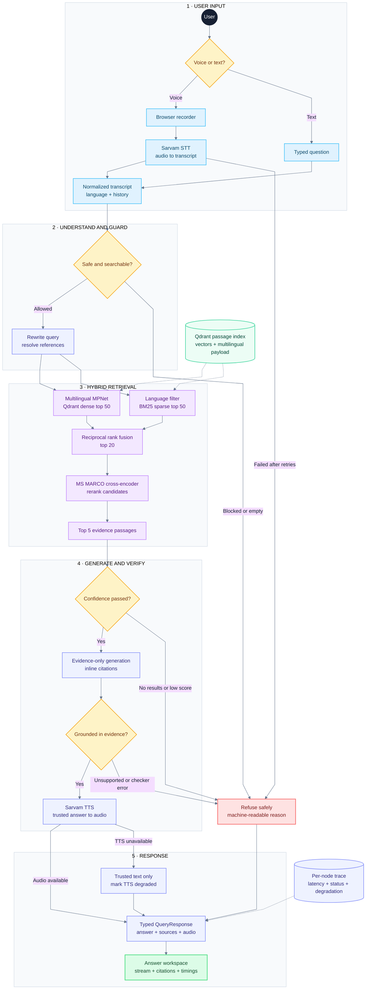
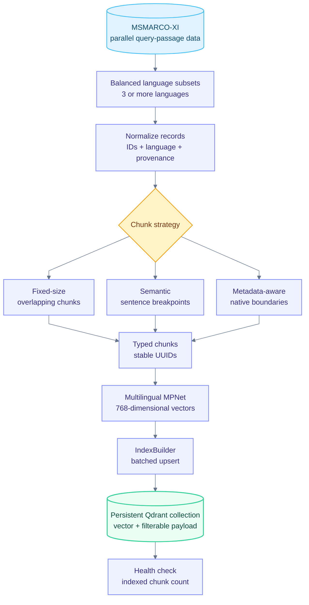
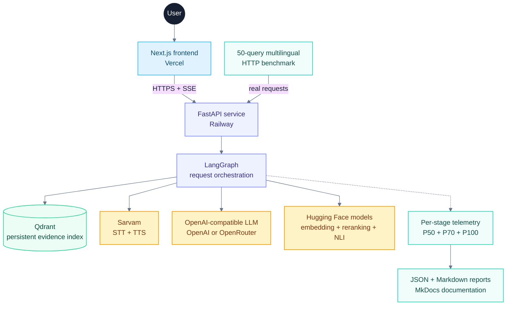

# Architecture

Vaaani has two connected planes: a live answer plane for voice and text requests, and an offline knowledge plane that prepares multilingual evidence. The architecture is split into focused flowcharts so each path stays readable in VS Code, MkDocs, and GitHub instead of being compressed into one poster-sized SVG.

## Live request flow

This is the primary end-to-end path. Read it top to bottom; each horizontal band is one stage of the request. Solid arrows are request or data flow. Dashed arrows are supporting data or telemetry.

The red refusal lane is intentionally shared by STT, topic safety, retrieval confidence, and groundedness. In particular, a groundedness-check exception after retries follows the same refusal path; an unchecked draft never reaches TTS.

## Knowledge and indexing flow

This flow runs offline. It creates the persistent collection consumed by both dense and sparse retrieval in the live request flow.

## Runtime and deployment flow

The browser talks only to FastAPI. Provider and storage boundaries remain explicit so their latency and failure state can be reported independently.

## Component responsibilities

### Online request plane

The browser sends the selected language, recent conversation turns, and either text or Base64-encoded microphone audio. `/query` returns regular JSON; `/query/stream` exposes metadata, validated answer tokens, optional audio, and a terminal request ID as server-sent events.

`ServiceContainer` composes providers during startup. LangGraph passes a typed `GraphState` between nodes, records per-node timing, and uses explicit conditional edges for success, degradation, and refusal paths.

### Hybrid evidence path

The rewritten query fans out into two retrieval paths:

1. **Dense:** multilingual MPNet produces a normalized 768-dimensional query vector and Qdrant performs cosine search under a language filter.
2. **Sparse:** the language-filtered corpus is tokenized and scored with BM25.
3. **Fusion:** reciprocal rank fusion combines both rankings into 20 candidates.
4. **Reranking:** an MS MARCO cross-encoder narrows the evidence to five passages used by confidence, generation, groundedness, and citations.

The Qdrant collection is the single evidence source. Dense and sparse paths use the same passage IDs, language fields, chunk strategy, translation provenance, and evaluation labels written by ingestion.

### Trust and refusal path

Three independent gates protect the answer:

- The topic classifier refuses unsafe or non-searchable input before retrieval.
- The confidence gate exposes both the computed score and configured threshold.
- The groundedness gate compares the draft with the top-five evidence passages.

Groundedness is deliberately **fail-closed**. If the checker fails after all retries, the graph refuses with `groundedness_check_unavailable`. Missing TTS may degrade to trusted text; missing evidence never degrades to an ungrounded answer.

### Response contract

| Channel | Contents |
|---|---|
| Answer | Grounded text with inline citation markers |
| Voice | Optional Sarvam-generated WAV audio |
| Evidence | Top-five passages, ranks, scores, language and provenance |
| Safety | Guardrail name, result, reason and quantitative details |
| Performance | Per-stage timestamps, duration, status and total latency |
| Operations | Request ID and explicit degraded-service names |

This contract drives `AnswerCard`, `SourceCitation`, `GuardrailBanner`, `LatencyDashboard`, and the status surface without hiding fallback or refusal behavior.

## Failure semantics

| Failure | Retry behavior | Terminal behavior |
|---|---|---|
| Sarvam STT unavailable | Three total attempts | Refuse with a specific STT reason |
| Qdrant retrieval unavailable | Three total attempts | Empty evidence reaches the confidence refusal path |
| Retrieval confidence low | No provider retry required | Refuse with score and threshold |
| LLM unavailable | Provider policy applies | Explicit offline mode may use extractive generation |
| Groundedness checker unavailable | Three total attempts | Fail closed with `groundedness_check_unavailable` |
| Answer unsupported by evidence | Deterministic decision | Refuse with `groundedness_entailment_failed` |
| Sarvam TTS unavailable | Three total attempts | Preserve trusted text and mark TTS degraded |
