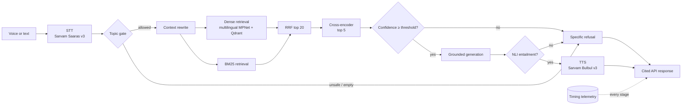

# Architecture

Vaaani separates orchestration from providers. Each LangGraph node accepts and returns the typed `GraphState`; provider adapters handle Qdrant, Sarvam, and the OpenAI-compatible generation endpoint. A node is retried twice after its first attempt. If all attempts fail, the node emits a degraded service or a specific refusal instead of leaking an exception to the interface.

## State and routing

`GraphState` contains inputs, conversation history, transcript, rewritten query, retrieval candidates, reranked evidence, guardrail decisions, answer/audio, service degradation, and timings. Conditional edges are based only on `refused`, so refusal paths are deterministic and easy to test.

## Deployment topology

The browser talks only to FastAPI. The API and Qdrant should share a region to keep retrieval below the 200 ms target. Sarvam and the generation provider are external network calls; their timings are reported independently. ML models load lazily so health checks and container startup do not wait for model downloads.

## Failure behavior

- Missing Sarvam STT on an audio-only request returns `sarvam_api_key_missing`.
- Missing or unreachable Qdrant becomes `no_retrieval_results` after the retrieval stage records degradation.
- Missing LLM credentials selects an extractive answer assembled only from retrieved evidence.
- Missing TTS credentials retains the text answer and identifies `sarvam_tts` as degraded.
- Low confidence and failed entailment produce visible, machine-readable refusal details.
